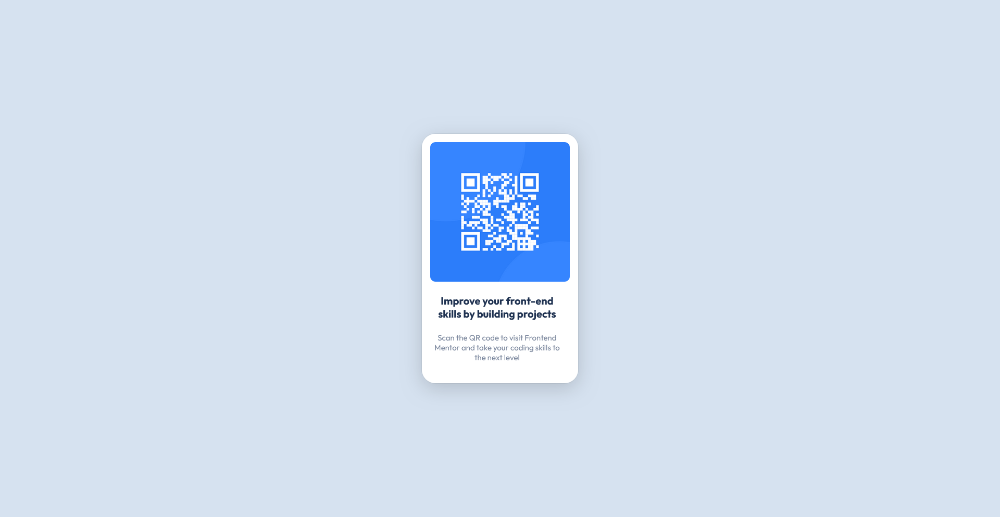

# Frontend Mentor - QR code component solution

This is a solution to the [QR code component challenge on Frontend Mentor](https://www.frontendmentor.io/challenges/qr-code-component-iux_sIO_H). Frontend Mentor challenges help you improve your coding skills by building realistic projects.

## Table of contents

- [Overview](#overview)
  - [My Solution](#my-solution)
- [My process](#my-process)
  - [Built with](#built-with)
  - [What I learned](#what-i-learned)
- [Author](#author)

## Overview

### My Solution

### Links

- [Live](https://)

## My process

### Built with

- Semantic HTML5 markup
- CSS custom properties
- Flexbox
- Mobile-first workflow

### What I learned

In this project, I learned the relationship between inner radius and outer radius.

## Author

- Buğra Başbostancı
- [Frontend Mentor](https://www.frontendmentor.io/profile/bb0143sbw)
- [Linkedin](https://www.linkedin.com/in/bugrabasbostanci/)
